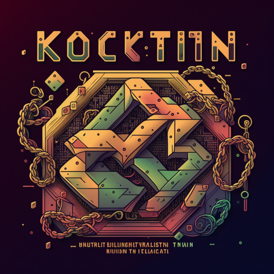

# Kotlinchain



Блокчейн, написанный на языке Kotlin. Написан с использованием фреймворка Ktor.

Для запуска (если отсутствует) собрать артефакт:
- Linux: ./gradlew jar
- Windows gradlew.bat jar

Созданный артефакт находится в /build/libs.

Запускать через командную строку в консоли/терминале, убедитесь, что последняя версия JDK установлена, как и переменная
окружения JAVA_HOME:
```
java -jar Kotlinchain-x.y.z.jar -p 8082 -n http://127.0.0.1:8080,http://127.0.0.1:8081 -d a.db -f
```
* p -- порт, на котором открыть сервер, обязательный;
* n -- ноды, в формате http(s)://IPv4:port через запятую, обязательный;
* f -- флаг для генерации 1-го блока, такой сервер в цепи может быть только 1, необязательный;
* d -- флаг для указания пути для записи в текстовый файл сгенерированных блоков, по умолчанию -- время 
создания файла в мс, необязательный;
* x, y, z -- заменить на текущую версию.

Аналогично запустить другие ноды блокчейна.

## ИЛИ

run.bat/run.sh в командной строке/терминале с использованием Docker

## ИЛИ

```
docker build -t enthusiasticprogrammer/blockchain .
docker-compose up
```


